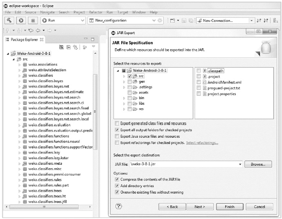

# Weka-Android-3-8-1
This repository includes a complete Eclipse project to build a Weka library for Android.
This project is covered in detail in chapter 6 of the [book](https://www.apress.com/us/book/9781484239506):

# About the Project
The most useful way to use the Weka ML library on Android devices is to port the library
to Android. The task is not trivial, but once completed, a **Weka.jar** file for Android can be used to easily integrate ML into Android apps.

It is important to use the same version of Weka throughout the ML-Gates pipeline.
If you use the latest stable version of Weka on the desktop to create ML models, you
must use the same version of Weka on the device to ensure compatibility, especially for
opening serialized pretrained models.

The book resources include the **Weka jar** file you will use for Android projects: **Weka-Android-3-8-1.jar**

The easy approach is to grab the **Weka jar** file and simply add it to your Android Weka projects.

# Project References

Project Name: **Weka-Android-3-8-1**

Source: **android_data_vis.zip** or **github.com/wickapps/Weka-Android-3-8-1**

Type: **Eclipse Project**

# Buiding a Weka library in Eclipse

If you wish to build your own Weka library for Android, the following steps summarize the initial setup process for porting Weka to Android:

* Start with the latest version of Weka that supports Java 7 (more on this
  later), version 3.8.1. Navigate to the weka-src.jar file. Unzip the file
  with the 7Zip utility. Navigate to src->main->java->weka. You will
  import this base directory into Eclipse after making a few changes.
* Delete all of the gui directory, except for the following files which you
  need to keep because of the high degree of dependency on objects
  contained within them:
  GenericPropertiesCreator.excludes
  GenericPropertiesCreator.java
  GenericPropertiesCreator.props
  HierarchyPropertyParser.java
  Loader.java
  Logger.java
  TaskLogger.java
* Delete the entire knowledgeflow directory. The KnowledgeFlow
  application is not required on Android.
* Delete the two files in the base directory, PluginManager.props and
  Run.java.
* Open Eclipse.
* Create a new Android project named Android-Weka-3-8-1.
* Set the project as a Library Project. The setting is in the Java Build
  Path settings.
* With the new project highlighted, select Import->General->File
  system. Import the weka base directory created earlier.
  The Android Weka project is now set up, but there are many errors to resolve before
  you can successfully build a Weka library for Android. 

Refer to the book for details on resolving all the build issues for the Anroid Weka library.

# Eclipse Library Export Screenshot

